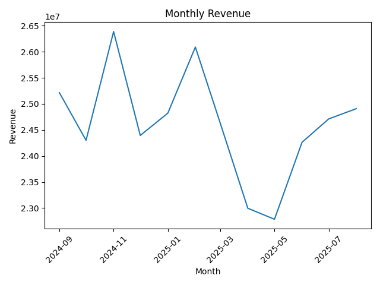
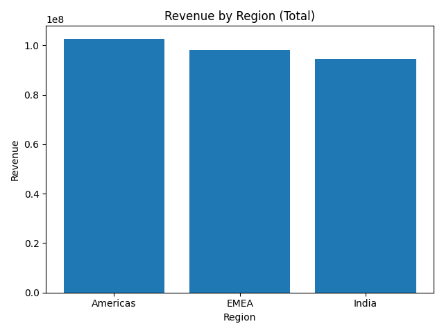
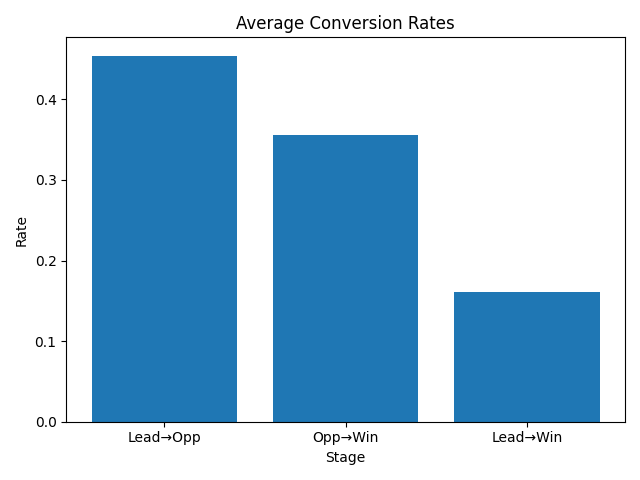
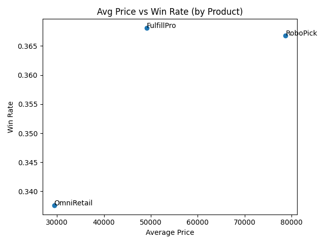
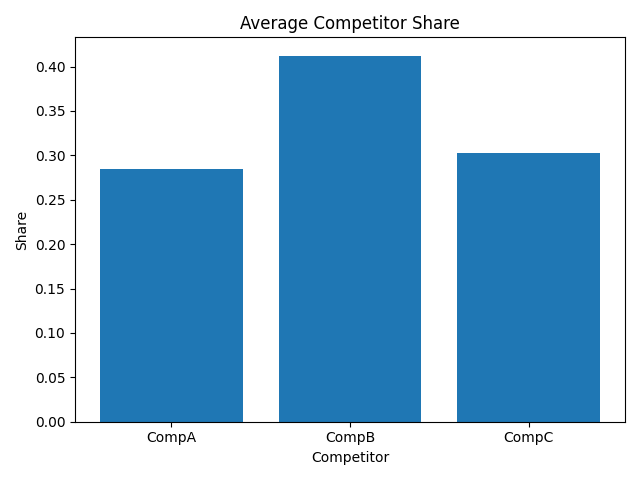

# 📊 MarketPulse – GTM Insights Dashboard

MarketPulse is a **Go-To-Market (GTM) strategy analytics dashboard** designed to extract **business insights** from synthetic sales, competitor, and customer datasets.  
It demonstrates **data-driven decision-making**, **stakeholder-ready visuals**, and **market research techniques** — perfect for program management and business strategy roles.

---

## 🚀 Features
- **GTM Strategy Insights** → Tracks product performance, regional trends, and customer segments.
- **Sales Funnel Analytics** → Lead → Opportunity → Win conversion rates.
- **Competitor Benchmarking** → Pricing, market share, and feature scoring.
- **CAC & ACV Metrics** → Highlights regions and products driving maximum ROI.
- **Stakeholder PPT Ready** → Charts for GTM recommendations.

---

## 📂 Project Structure
├── data/      # Datasets (sales, competitors, survey)
├── analysis/     # Python scripts for KPI calculations and visualization
├── outputs/      # Excel summary + visual charts
└── README.md      # Documentation & visuals

---

## 📸 Visual Insights
| **KPI**                     | **Visualization**                                |
|---------------------------|---------------------------------------------|
| Monthly Revenue Trend    |  |
| Revenue by Region       |  |
| Conversion Funnel       |  |
| Price vs Win Rate       |  |
| Competitor Share        |  |

---

## 📊 Tech Stack
- **Language**: Python (Pandas, Matplotlib, OpenPyXL)
- **Visualization**: Excel, Charts, Pivot Tables
- **Tools**: VS Code, GitHub, PowerPoint

---

## 🛠️ Installation & Usage
```bash
# Clone the repository
git clone https://github.com/<your-username>/MarketPulse-GTM-Dashboard.git

cd MarketPulse-GTM-Dashboard

# Install dependencies
pip install -r analysis/requirements.txt

# Generate datasets (optional)
python analysis/data_gen.py

# Run analysis & generate visuals
python analysis/analyze.py
